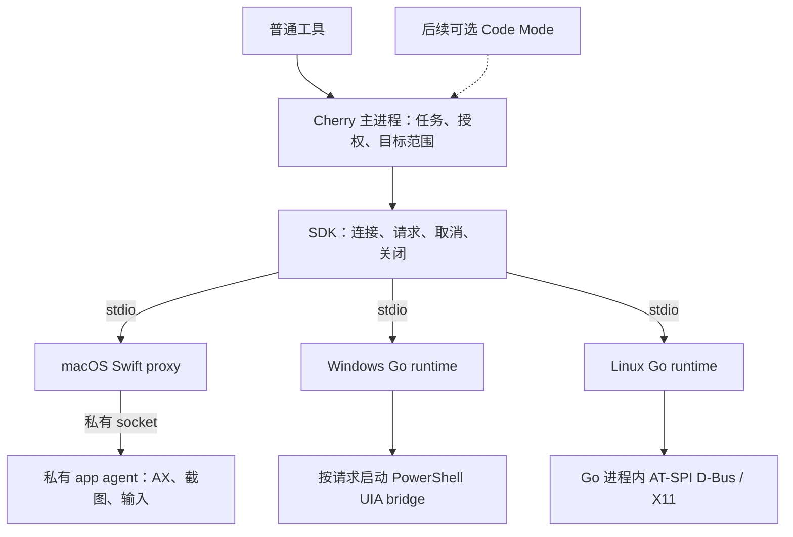
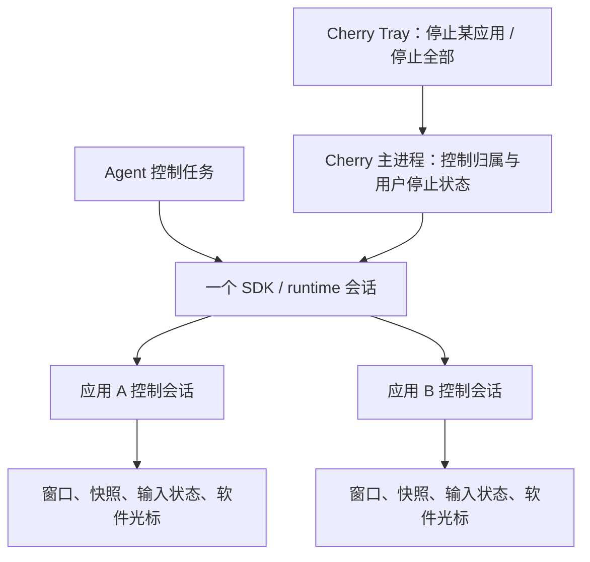
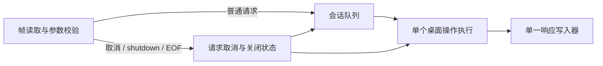
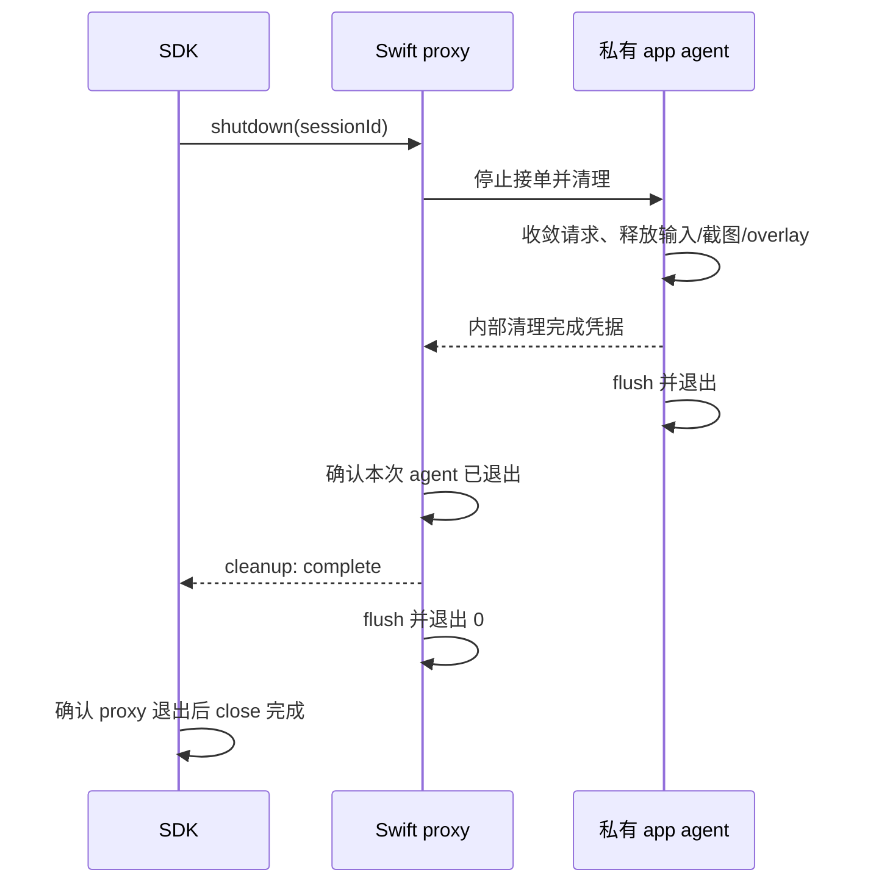

# Computer Use 原生运行时设计

状态：2026-09-17 三端生命周期及首个结构化桌面切片已实现，Windows 11 ARM64/Linux X11 已通过 SDK 真实桌面测试；macOS GUI 等待系统授权。承接 [SDK 设计](computer-use-sdk.md)与 [SDK/npm 执行计划](../exec-plans/active/20260916-sdk-npm-distribution.md)。Cherry 已接入本地权限引导；原生每应用控制会话已接通；Cherry 控制归属/用户停止状态、Tray 停止、SDK 软件光标、其余动作、Wayland、平台分发和 Agent 工具接入仍未完成。

## 本轮实现与证据

- 三端 `serve --stdio --session-id` 保留私有生命周期，接入 `listApps → getAppState → act(click)`。Windows/Linux 复用 [Go session 与 Desktop](../../packages/runtime-go/README.md)，macOS 使用 [Swift desktop](../../packages/OpenComputerUseKit/Sources/OpenComputerUseKit/SDKDesktop.swift)及 [私有 app agent](../../apps/OpenComputerUse/Sources/OpenComputerUse/MacOSSDKRuntime.swift)。控制读取、串行执行和响应写入分离。
- 原生端持有应用进程身份和元素引用，只向 SDK 发会话私有 ID、树层级、动作、截断标记和 PNG。重新观察、尝试执行动作都会使目标的旧快照失效；执行前再校验原生身份、名称、角色及动作，拒绝跨会话和过期引用。
- 本切片只执行一个元素的左键语义动作：macOS AXPress/AXConfirm/AXOpen、Windows Invoke/SelectionItem/Toggle、Linux AT-SPI click/press/activate。没有坐标输入、按住键鼠、窗口激活或全屏截图兜底；其余六种动作、非左键/多次点击明确不支持。macOS 已接通显式 `requestPermissions`；Windows/Linux 尚无对应系统授权流程。
- 动作与观察分开：确认原生调用成功后，采集失败或取消仍返回 `completed`。调用结果未知时保留 `effect: possible`，禁用本会话后续桌面操作；不重试动作。单次原生调用无法收敛时，取消/关闭失败不能伪装清理完成。
- 截图独立报告可用性。macOS 用 PID、标题和窗口几何匹配 ScreenCaptureKit；Windows 对所属 HWND 调用 PrintWindow；Linux 仅在 X11 中按 PID、标题匹配唯一可见窗口，并限制像素格式和尺寸。无法可靠映射时返回 unavailable。当前不返回元素坐标边界，也不接入 Wayland capture。
- macOS 权限查询仅调用 app agent 身份的非交互 preflight，未授予返回 unknown。显式申请先验证完整权限 ID 列表，再复用 app 层已有拖拽授权窗口，打开相应系统设置。请求在拖拽被接受、用户完成、关闭或实际获授权前保持 pending；拖拽成功立即收起浮层并结束 SDK 引导，但不推断授权成功，宿主随后用新 helper 检查权限；关闭/取消会清理窗口、浮层和监视器，返回实际 preflight 结果，不把请求成功当成 granted。SDK 模式不走旧窗口的退出/重启 app 流程。默认交互超时为 5 分钟，可由调用方覆盖。Cherry 保持 helper 存活至引导结束，再用新 helper 重新检查；Agent 控制任务仍须持有自己的长会话。Windows/Linux 的空权限列表表示没有接入 OS 授权流程，不能代替宿主授权。macOS GUI 待用户在系统设置授予辅助功能和屏幕录制；没有绕过 TCC。
- [原生契约测试](../../protocol/native.test.mjs)：macOS 5 项通过，Windows ARM64 与 Linux ARM64 各 4 项通过、macOS 专用项跳过。Swift 9 项、共享 Go 12 项（含 race detector）通过；两端既有 Go 单测通过。
- [真实桌面测试](../../protocol/desktop.test.mjs)：Parallels Windows 11 ARM64 与无 Python 的 Linux Xvfb/GTK 容器均完成 `Count: 0 → 1 → 2`、PNG、层级/截断、跨会话与过期快照拒绝、独立关闭。Windows 另验 Job Object 在请求取消和 Go owner 强杀时终止 worker/子进程。操作仅针对自建 fixture。
- Windows 实测暴露默认 UIA provider 初始化失败：.NET 的栈检查遇到 PowerShell 动态帧会抛空引用，WinForms 按钮因此缺少 InvokePattern。共用 bridge 在保留 C# 调用帧的初始化方法内触发默认 provider 加载，真实按钮测试覆盖修复；参见 [Microsoft 的加载实现](https://github.com/dotnet/wpf/blob/main/src/Microsoft.DotNet.Wpf/src/UIAutomation/UIAutomationClient/MS/Internal/Automation/ProxyManager.cs)。

平台 npm 包、远端 CI、其余桌面环境和 Electron 制品尚未验收。复现步骤见 [桌面 fixtures](../../protocol/fixtures/README.md)与 [Linux 实验](../../experiments/LinuxNativeProbe/README.md)。

## 会话与进程

一个控制任务复用一个 SDK 实例；runtime 表示该实例拥有的整组原生资源，不要求只有一个 OS 进程。任务结束时一起关闭，不建立跨任务共享 daemon。普通工具是第一阶段入口；后续 Code Mode 通过同一宿主调用边界接入。



图中 runtime 路径已接入首个桌面切片；Cherry 当前仅接入权限引导，Agent 工具与 Code Mode 仍是后续宿主接入。三端统一协议、结果语义与关闭条件；Linux 的 AT-SPI/X11 路径已采用 Go 进程内实现，无 Python/cgo。Wayland 的 API 绑定与进程布局仍需独立实验。

| 层 | 唯一负责的状态 |
| --- | --- |
| Cherry | 控制任务、宿主授权、目标范围、不同任务对同一桌面的协调 |
| SDK | 所属 runtime 进程、传输连接、请求 Promise、超时和关闭结果 |
| 原生会话 | 请求队列、取消状态、快照有效性、所属 worker 和平台资源 |
| 平台后端 | 原生元素引用、输入状态、截图资源、OS 权限与 portal 会话 |

Swift 的元素与快照留在 app agent；Windows 的快照记录留在 Go，短命 PowerShell bridge 执行前重新定位并校验目标；Linux 的原生引用、快照有效性和 portal 资源由实际平台后端统一持有。若采用过渡 Python worker，Go 不再另建一套快照缓存。任何原生引用都不序列化到 JS 后重建。

## 应用控制会话、Tray 停止与软件光标（原生契约已实现）

2026-09-18 确认：第一阶段普通工具接入需要按应用展示、停止控制，并提供跟随动作的软件光标。这来自用户对 Codex 可见体验的描述；以下是 Cherry 的设计决策，不据此推断 Codex 内部的进程或会话实现。Code Mode 仍属后续阶段，关闭时普通工具具备相同的控制与停止能力。

### 本轮落地范围

SDK、Swift 和共享 Go runtime 已实现协议 v2 的 `openAppSession`、`listAppSessions`、`stopAppSession`。观察和所有动作显式绑定应用会话，原生快照按会话隔离；活动目标重复打开复用上下文，停止后显式重开产生新 ID，旧 ID/快照不能复用。

状态查询与停止走独立控制路径，普通队列满时仍保留停止入口。停止先标记 `stopping` 并取消当前调用，阻止旧上下文中的排队/新请求；当前调用收敛后释放快照及引用，返回 `stopped + cleanup: complete`。一秒内不能确认则保留停止中，禁用 runtime 桌面操作；SDK 报告清理未确认并关闭连接。派发后的停止不能通过取消该请求撤销。当前没有接入按住键鼠和 overlay，对这些资源的清理仍属于后续动作阶段。

现阶段只提供 runtime 内的隔离和停止，不代替 Cherry 的跨任务协调或用户停止状态。宿主仍须阻止工具通过显式重开/新建 runtime 绕过停止；Tray、普通工具接入和光标尚未实现。应用发现列表移除目标时回收上下文，执行时继续校验原生身份；持续窗口/退出监听随 overlay 接入。

验证：SDK 类型/36 项测试（含 ESM/CJS tarball）、Swift 15 项会话测试、共享 Go race 测试通过；macOS 6 项原生协议测试及 Linux X11 真正 GUI 点击/停止通过。Windows x64 CI（`windows-2025`）已通过原生协议、worker/后代清理及真实计数窗口点击/停止；Windows ARM64 已构建，Parallels 问题导致本地 GUI 复测仍待完成。macOS 已换固定证书签名，系统重新授权及授权后 GUI 仍待用户完成。

### 两层会话与资源归属

保留“一项 Agent 控制任务持有一个 SDK/runtime 会话”，在其内部增加每应用控制会话。它是应用实例的控制上下文，不要求每个应用再启动一个 helper。应用会话按需建立，任务结束时一起释放；权限引导继续使用独立短会话。



| 层 | 新增职责 |
| --- | --- |
| Cherry 主进程 | 任务与应用控制归属、同一应用实例的跨任务协调、用户停止状态；向 Tray 和 Agent adapter 提供同一份状态 |
| SDK | 类型化的应用会话标识、停止请求与状态回报；不依赖 Electron，不创建 Cherry Tray |
| 原生 runtime | 每应用的进程/窗口身份、快照与原生引用、排队/进行中动作、输入状态、光标及其清理；应用退出或重启使旧控制上下文失效 |
| Cherry Tray | 展示被控制的应用及所属任务，提供单应用停止和全部停止；不自行判断原生动作已结束 |

同一个应用实例的控制归属覆盖完整的“观察 → 操作 → 再观察”过程，不能仅对单次点击加锁。停止、重新建立应用会话或应用重启后，旧快照均不可复用。软件光标状态按应用隔离，实际绘制跟随该应用的目标窗口；窗口移动、隐藏或退出时同步更新或隐藏。

### 用户停止的契约

1. 用户点击停止后，Cherry 立即阻止该任务继续向目标应用派发新操作，并通过 SDK 把停止传到原生控制通道。停止消息不能排在普通动作队列后等待。
2. runtime 拒绝该应用会话的新操作，撤下排队动作，取消并等待进行中的动作收敛；随后释放本会话持有的按键/鼠标按钮、原生引用和截图资源，失效快照，结束动画并销毁光标。
3. Tray 在清理期间显示停止中，仅在原生确认后显示已停止。无法确认输入释放时报告未确认并禁用相关执行路径；不能只隐藏浮层或结束 JS Promise 就宣告成功，已经发生的操作也不会回滚。
4. 单应用停止只结束该应用的控制上下文，不关闭目标应用本身；在资源隔离成立时，其他应用会话继续可用。全部停止覆盖当前所有控制任务；任务结束和宿主退出同样走清理流程。若共享输入状态无法收敛，按既有失败契约禁用整个 runtime 会话。
5. 用户停止状态由 Cherry 保留，Agent 下一次工具调用、后续脚本或重新创建 SDK 都不能自动恢复该任务对这个目标的控制。继续控制需要用户明确允许；Agent 应收到可解释的停止结果。

现有 `AbortSignal` 只取消一个请求，`close()` 关闭整个 runtime；两者都不能单独表达上述每应用停止契约。公共 schema、SDK 与三端原生契约现已增加上述应用上下文、停止与状态查询，具体签名见 [协议说明](../../protocol/README.md)。下一步由 Tray 消费；仍不引入通用事件总线。

### 软件光标与实际输入

- runtime 根据真实执行阶段驱动移动、点击、输入提示和拖拽动画。动画只表达执行反馈，不能代替动作结果；不展示输入文本内容，也不先播放成功动画再尝试动作。
- 优先复用现有 [SoftwareCursorOverlay](../../packages/OpenComputerUseKit/Sources/OpenComputerUseKit/SoftwareCursorOverlay.swift)、[CursorMotionModel](../../packages/OpenComputerUseKit/Sources/OpenComputerUseKit/CursorMotionModel.swift) 与渲染代码。当前 overlay 使用进程级静态状态，SDK desktop 路径尚未接入；需先把可变状态和资源清理归属迁到应用会话，再接 SDK 动作。
- 每应用一个软件光标不意味着系统提供多个独立输入指针。支持语义或定向操作时遵守已有后台执行约束；需要全局输入时，由 Cherry 协调独占使用，runtime 继续校验显式允许条件。不得为了完成动画而悄悄移动真实鼠标、抢占焦点或切换输入后端。
- 会话、停止和结果契约跨三端一致；macOS、Windows、Linux 的浮层绘制、窗口跟踪和输入能力分别实现与验收。X11 与 Wayland 分开报告；缺少光标展示能力不等于动作已失败，未实现的输入能力也不能靠动画伪装支持。

### 验收顺序

先固定 macOS helper 的签名身份并完成真实权限/桌面验收，再实现应用控制会话 → Tray 单应用/全部停止 → 已支持点击的光标反馈 → 输入、移动和拖拽及其分步取消，随后推进完整三端与打包验收。

必须覆盖：两个应用的状态和光标互不覆盖；单应用停止不结束另一个应用或目标进程；排队操作在停止后不再执行；运行中的输入收敛且无按键、鼠标按钮和 overlay 残留；用户停止后 Agent 重试不能恢复控制；旧应用会话和快照被拒绝；全部停止、应用退出、owner EOF 均可回收所属资源。全局输入冲突、窗口移动/缩放/跨屏及 Wayland 限制另有平台实测，不能以静态动画或协议 fixture 通过代替。

## 设计决策：Go 的职责与 Python 的定位

2026-09-17 确认以下选型方向；随后完成 Go AT-SPI/X11 原型并接入 SDK，Wayland 最终布局仍需验证。本节修订初始提案中把持续存活的 Python worker 作为 Linux 默认结构的表述。

- **Go 负责 Windows/Linux 的协议、会话和请求调度。** 沿用现有入口，便于以预编译可执行文件随平台包分发，用户不需要安装 Go。goroutine 可分开处理控制读取与串行执行，`context` 传递取消和期限；实际平台调用仍须实现取消，不能只结束等待它的请求。参见 [context 文档](https://pkg.go.dev/context)。
- **原生后端依据系统 API 的接入成本决定。** 优先用 Linux 真实观察、点击、截图原型验证 Go 直接接入系统接口的可行性，必要时使用有限的原生库绑定。Go 通过 cgo 调用 C 库会引入编译、交叉构建及链接依赖，不能承诺单文件零依赖；参见 [cgo 文档](https://pkg.go.dev/cmd/cgo)。
- **Python 是过渡复用选项。** 现有 GI/AT-SPI 代码可以降低首个闭环的开发成本，但需要承担 Python/GI 环境、额外进程通信和清理成本。npm 包携带脚本不代表这些依赖已经包含。若 Go 最终只负责启动 Python 和转发 JSON，应重新评估这一层的收益，不为保留语言分层而增加进程。
- **Wayland 要求任务内持续存活的会话，不限定语言。** 后端必须持有并清理 D-Bus、portal、采集与输入资源；是否需要独立 Python worker 由原型结果决定。
- **独立 helper 的收益与语言选型分开。** 故障隔离和 Electron ABI 解耦来自进程边界，其他编译型语言也能实现。macOS 继续使用 Swift 和完整 `.app` 身份，不以统一语言为目标重写三端。

最终选择 Linux 后端前，原型必须回答：

1. Go 直接接入能否完成真实应用的观察、点击和截图；X11 与 Wayland 分别报告结果，包含目标/坐标映射。
2. 运行中取消、owner 断连和退出能否收敛原生调用并释放资源。
3. 平台制品在没有 Python 的目标环境能否运行，需要哪些系统库、桌面服务及构建依赖；目标架构构建成功与真实桌面执行分别验证。

当前 AT-SPI/X11 切片已通过无 Python 环境验收，使用 godbus/dbus 与 jezek/xgb。若 Wayland 实验暴露绑定或打包障碍，记录具体成本后再定后端；不承诺全部使用纯 Go，也不把 Python 固定为长期依赖。

## 当前源码需要改变的边界

| 现状 | 对 SDK 契约的影响 | 拟议改动 |
| --- | --- | --- |
| 旧 [macOS proxy](../../apps/OpenComputerUse/Sources/OpenComputerUse/MacOSAppAgentProxy.swift)逐条同步转发，连接既有 agent；LaunchServices 回调丢弃 app 对象 | 动作期间取消无法及时转发，proxy 退出也不能证明 agent 退出 | 已增加 SDK 独立启动路径，保留本次 app 实例身份；双向独立读写与所属实例退出确认 |
| [Swift MCP server](../../packages/OpenComputerUseKit/Sources/OpenComputerUseKit/MCPServer.swift)同步执行；[service](../../packages/OpenComputerUseKit/Sources/OpenComputerUseKit/ComputerUseService.swift)返回 `ToolCallResult` | 协议、业务结果和展示文本耦合 | 提取结构化执行结果，SDK 与 CLI/MCP 分别适配；不解析 MCP 文本 |
| Windows [Go bridge](../../apps/OpenComputerUseWindows/main.go)用后台 context 加固定超时，且合并 stdout/stderr | SDK 取消未进入请求 context，诊断可能污染 JSON | 请求 context 贯通，独立协议输出；增加 worker 的取消检查和退出确认 |
| [PowerShell](../../apps/OpenComputerUseWindows/runtime.ps1)和 [Python](../../apps/OpenComputerUseLinux/runtime.py)在动作后直接采集快照 | 采集失败可能掩盖已经执行的动作 | 后端拆成执行动作、采集状态两个操作，由原生会话组合结果 |
| [Linux Go bridge](../../apps/OpenComputerUseLinux/main.go)每次调用重启 Python，使用后台 context | 不适合承载跨工具调用的 portal/采集会话 | 后端会话按任务存活；优先验证 Go 直接接入，若保留 Python 则采用任务私有 worker；owner 断开触发清理 |

上表保留基线的迁移边界。当前 SDK 直接读取平台 API，Windows 复用 bridge 定义；没有解析 MCP 文本，也尚未把旧 CLI/MCP 全部迁到 SDK 核心。后续动作继续按相同领域契约接入，避免现在扩大重构范围。

## 控制消息始终可达



- `initialize` 完成前拒绝业务请求；`ownership: private` 只在必需的控制链就绪并确认所有权后返回。可选后端缺少依赖时由能力查询报告，不能因此宣称它已可执行。原生端也验证 session、请求 ID、参数和版本。
- 观察、权限请求及动作按会话串行执行。控制读取不等待它们结束；取消可撤下排队请求，也能送达执行中的平台后端。
- 每个请求只有一个终态响应。取消通知本身没有成功回包；以原请求的结果确认执行端是否停止。已经完成的动作可以赢过取消。
- Swift 的 AX/输入状态由单一执行路径管理，AppKit 工作回主线程；Go 用串行执行 goroutine。单纯增加 `async`、Swift actor 或取消 Go context，不等于中断了正在阻塞的原生调用。
- 输入分步、等待和采集都有取消检查及有限等待。响应按完整帧串行写入；慢读和断管也不能阻塞控制接收与资源清理。stdout 只放协议，诊断走 stderr。

当前生命周期/点击切片继续使用现有 `Content-Length` JSON-RPC，不增加公共事件总线或流式动作。每应用控制会话已通过协议 v2 增加必要的 SDK 方法与状态查询；v1 helper 在握手时拒绝。平台内部可以有私有控制通道，但必须把取消送到真正执行输入的进程。

## 动作完成与观察完成分开

```text
act(request)
  校验 snapshot、进程/窗口/元素身份、坐标映射与执行条件
  检查取消，令该目标旧 snapshot 失效
  receipt = backend.execute(action, cancellation)
  observation = backend.observe(target, cancellation)
  返回 completed + observation
```

后端 `execute` 返回结构化执行凭据，不再隐式截图。`observe` 使用单独的采集阶段；即便整个 SDK `act()` 仍只返回一个结果，原生会话也已经知道动作是否完成。

| 中断位置 | 对外结果 |
| --- | --- |
| 尚未执行，排队时取消或目标校验失败 | 错误，`effect: none` |
| 输入已经开始，取消或 bridge 失联，无法确认完成 | 错误，`effect: possible`；本切片禁用该会话的后续桌面操作 |
| 已确认动作执行，随后截图失败或取消了采集 | `completed`，`observation: unavailable` |
| 动作与采集均完成，取消随后到达 | 返回已完成结果 |

`completed` 只确认原生动作执行，不证明目标应用完成了业务操作。原生调用开始与完成凭据之间存在不确定区间，不能因为没有收到成功 JSON 就宣称 `effect: none`。不自动重试输入。

快照绑定当前会话、应用进程身份、窗口和元素；不只依赖可复用的 PID 或数组下标。执行前再次确认目标与窗口几何；不能确认时拒绝使用旧引用。坐标映射留在后端，不能把显示器坐标直接当成窗口截图像素。外部 UI 仍会变化，这些检查不承诺桌面操作具有事务原子性。

## 各平台生命周期

### macOS：私有 app agent

SDK 的 `serve` 路径不复用旧共享 socket，也不向未知 agent 发 `terminate`。为本次启动创建私有目录/socket，结合文件访问权限、连接身份及启动返回的 app 实例建立所有权；`sessionId` 只标识会话，不能独自证明所有权。

proxy 经 LaunchServices 启动完整 `.app`，保存返回的 app 实例和退出观测，不只记录可被复用的 PID。初始化失败、owner EOF 或启动期间取消，都关闭本次实例；若启动回调晚于取消，回调仍负责收回刚创建的实例。agent 未建立 owner 连接时也要有启动超时。

agent 独立读取控制消息，AX 引用、截图与 overlay 全部在这个进程内。连接断开后执行自己的清理流程。SDK 路径使用不可变会话配置和每次操作的明确选项，不依赖旧 MCP 路径逐请求修改进程环境变量。



内层清理凭据与外层 `shutdown` 响应不是同一时刻。proxy 必须等所属 agent 的退出证据，不能收到一条 socket 回包就向 SDK 宣告成功。

### Windows：Go 持有会话，PowerShell 按请求执行

第一步保留已有短命 PowerShell bridge，避免先重写 UIA 引擎。Go 保存快照记录和请求状态；把动作、观察拆开后分别调用 bridge。若启动成本影响交互，再依据测量决定是否把 PowerShell 改为持续存活。

本切片取消通过请求私有的命名事件到达脚本，在调用语义动作前检查。只读 worker 可终止并等待退出；语义动作一旦派发则等待结果，不能以杀进程宣称动作未发生。后续若增加分步键鼠输入，还需在 `finally` 中恢复输入状态。

已用 Go runtime 持有的 [Windows Job Object](https://learn.microsoft.com/en-us/windows/win32/procthread/job-objects)管理 bridge：worker 在开始工作前完成加入，禁止脱离，job handle 不传给 worker，并启用 kill-on-close。最后一个 job handle 关闭会结束其中的进程；仍需确认 worker 退出与输入释放，不能把 `CommandContext` 取消当作整组资源已清理。

### Linux：按任务保留后端会话

当前 SDK 由 Go 进程持有 AT-SPI D-Bus 连接与快照，关闭时释放连接；只连接现有桌面 session bus，不隐式启动 dbus-launch。AT-SPI 连接丢失后要求新建 SDK 会话，避免把重启后复用的 bus 名称当成旧目标。X11 采集连接按请求关闭。语义 DoAction 派发后等待确认结果，丢失回包报 uncertain。以下 portal/PipeWire 与输入资源要求属于后续 Wayland 阶段，不表示已经实现。

- X11：以现有语义操作和截图路径为行为参考，验证 Go 直接接入，按真实依赖报告能力。
- Wayland：通过 [RemoteDesktop 与 ScreenCast portal](https://flatpak.github.io/xdg-desktop-portal/docs/doc-org.freedesktop.portal.RemoteDesktop.html)建立授权、采集和输入会话；使用 PipeWire 画面，输入后端按 portal 能力选择。若建立 EIS 连接，就使用该连接发送输入，不再混用 `Notify*`。
- `getPermissionStatus` 不启动授权对话框；显式 `requestPermissions` 才发起交互。权限归属于实际后端会话，不能借一次短命 Python 调用取得权限后立即销毁连接。
- owner 管道 EOF 触发输入释放、portal 关闭和后端退出。若创建 worker，由 Go 管理所属进程组；异常死亡时的 worker 收回必须通过独立的 owner 存活检测及目标系统实验验证。进程组存在本身不保证父进程退出就会清理子进程。

portal 的 [Session 规范](https://flatpak.github.io/xdg-desktop-portal/docs/doc-org.freedesktop.portal.Session.html)规定 D-Bus 客户端消失等同于关闭它创建的会话。因此生命周期应归属于任务持续存活的后端；这只是 portal 资源的关闭规则，不证明 X11 或其他输入状态也已恢复。

Wayland 必须先做一个边界实验：GNOME/KDE 下能否把 portal stream、应用窗口、AT-SPI 元素与输入坐标可靠对应。当前 SDK 是应用/窗口快照模型；若只能获得显示器画面且无法可靠映射，先提议扩展 schema 的目标与坐标模型，再接相应能力。禁止伪造窗口信息或把整屏内容标成该应用截图。`allowGlobalInput: false` 时，也不能悄悄切换到全局 portal 输入。

## 取消与关闭的验收条件

会话从启动进入可用，再进入关闭，最终关闭或失败；失败后不接收新动作、不恢复连接、不重放请求。普通请求取消不自动等同于关闭整个会话，但无法确认执行端已停止时必须禁用会话。

现有 SDK 对取消确认、shutdown 和退出使用分段的两秒等待上限。原生实现必须先实测这几个阶段；单次 AX/UIA 调用无法收敛时应暴露失败，不能先回复取消成功让动作继续。若真实平台数据证明需要调整客户端策略，单独修改并验证协议/SDK，不靠扩大超时掩盖控制消息阻塞。

关闭成功要求：停止接单、移除排队请求、收敛执行中的请求、释放输入与平台资源、结束所属 helper、返回清理凭据、外层进程正常退出。强杀不会运行 `finally`；拿不到输入清理确认时只能报告未确认，不能仅凭进程退出宣布 `cleanup: complete`。

## 实现切片与改动位置

| 切片 | 改动 | 必须获得的证据 |
| --- | --- | --- |
| 1. 原生生命周期 | 三端增加 `serve --stdio`；先实现 initialize、能力/权限状态查询、取消与 shutdown | SDK 连接真实 native；启动失败、EOF、取消期间关闭、两实例隔离；macOS 连同 app agent 退出，Windows/Linux 连同实际创建的 worker 退出 |
| 2. 结构化观察与点击 | service 结果去除 MCP 展示耦合；目标/快照身份；执行与观察分离 | 真正 GUI 中观察和点击；旧快照拒绝、截图失败不重复点击、运行中取消不遗留输入；分别记录原生协议与桌面效果证据 |
| 3. 应用控制与可见停止 | 增加应用会话契约、Cherry Tray 停止、每应用光标；先覆盖已支持的点击 | 双应用隔离、停止后无新动作与资源残留、用户停止不可被 Agent 自动恢复、反馈与实际动作一致 |
| 4. 完整平台能力 | 补齐其余动作、权限流程与 Wayland 后端；消费实际平台 tarball | macOS、Windows、Linux X11、GNOME Wayland、KDE Wayland 分别验收；完成 Cherry 普通工具全能力及打包应用验收 |

Linux 的 Go 原生接入原型及 Wayland 目标/坐标实验在切片 1 期间进行，先确定后端布局与公共模型是否适用。三端均是交付目标，部分能力暂不可用只描述实现进度。

建议的代码落点：

```text
protocol/                              # 公共 schema + 三端共用契约 fixture
packages/OpenComputerUseKit/            # Swift 结构化 service、会话、SDK 协议适配
packages/runtime-go/                    # framing、请求生命周期、快照与动作结果编排
apps/OpenComputerUse/                   # serve 入口、私有 app agent 启动与退出
apps/OpenComputerUseWindows/            # Windows backend、取消事件、Job Object、PowerShell
apps/OpenComputerUseLinux/              # Go AT-SPI/X11 SDK backend；保留旧 CLI/MCP
```

共用 Go 包提取两个实际消费者的协议、生命周期、快照与动作/观察结果编排；平台 driver 只提供发现、观察、语义点击和资源释放，不引入插件注册系统。两个现有 Go module 的构建引用随首个实现切片一起调整。优先复用标准库或成熟协议组件，以同一 schema 的有效/无效请求和分帧 fixture 验证 Swift/Go 实现，而非各自维护一套宽松的协议解释。

后续仍需验证具体 portal/PipeWire 库选择与系统依赖打包、强制中断后的输入恢复、Wayland 目标模型；本轮语义点击闭环不作为这些能力已经交付的证据。
