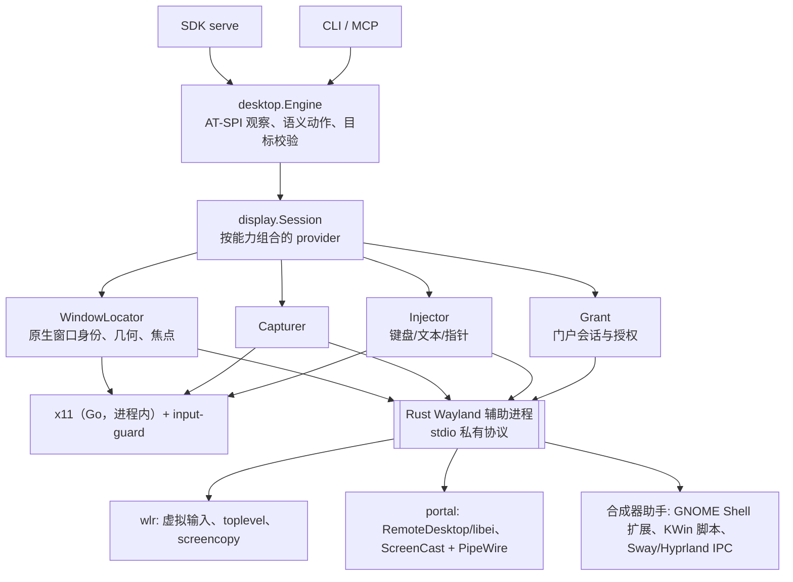

# Linux 显示后端架构：X11 与 Wayland

状态：2026-10-09 架构提案，尚未实现。X11 后端已作为[共用引擎](../exec-plans/active/20261009-linux-shared-engine.md)的一部分实现；本文定义如何在同一引擎内加入 Wayland 及其不同合成器，不改变 SDK 协议语义。语言分工（2026-10-09 决定）：Go 保持协议、会话、AT-SPI 与 X11；Wayland 平台细节由 Rust 辅助进程实现。决定自研，不嵌入第三方驱动；[trycua/cua](https://github.com/trycua/cua/tree/main/libs/cua-driver/rust/crates/platform-linux) 的 Linux 驱动只作参考。

## 目标与非目标

- 目标：AT-SPI 观察与语义动作在所有会话类型上共用一份实现；截图、窗口定位与全局输入按会话能力选择后端，并分别报告可用性。
- 目标：同一安全契约适用于所有后端：输入必须能绑定到观察到的目标窗口，做不到就在发送前拒绝，而不是送到别处后报告成功。
- 目标：Go 主程序保持无 cgo，X11 用户只需要它。Wayland 会话按需启动 Rust 辅助进程；需要额外系统库或安装步骤的能力是可选层，缺失时如实报告。
- 非目标：首批不支持所有合成器；不把 X11 注入（含对 XWayland 的 XTEST）当作 Wayland 支持；不绕过门户授权或合成器的安全策略。

## 为什么 Wayland 需要独立的结构

X11 中一个客户端即可查询任意窗口位置、读取像素、用 XTEST 注入输入，并通过输入焦点确认目标。Wayland 刻意不提供这些：

| 能力 | X11 | Wayland |
| --- | --- | --- |
| 窗口屏幕坐标 | `TranslateCoordinates` | 无全局坐标；GNOME 下 AT-SPI 窗口位置为 `0,0`，`org.gnome.Shell.Introspect` 不对普通客户端开放 |
| 焦点窗口 | `GetInputFocus` | 无标准查询；只能用 AT-SPI `ACTIVE` 状态或合成器私有接口 |
| 截图 | `GetImage` | 门户 ScreenCast + PipeWire、wlroots screencopy、或合成器内扩展 |
| 输入 | XTEST | 门户 RemoteDesktop（D-Bus `Notify*` 或 libei）、wlroots 虚拟设备协议 |
| 授权 | 无 | 门户会弹出系统授权；可持久化 |

而且不同合成器提供的协议不同：wlroots 系开放虚拟输入和 screencopy 协议，GNOME/KDE 主要通过门户，GNOME 的窗口几何只能从 Shell 内部获得。因此不能写一个 `wayland` 后端，而要按能力拼装。

## 分层



- **Engine（不变）**：AT-SPI 连接、树、语义动作、执行前重新校验。它不知道显示服务器类型，只向 `display.Session` 请求"这个 AT-SPI 窗口对应的原生窗口"和后续能力。
- **display.Session**：每个 runtime 一个，启动时探测会话，组合各 provider；持有所有原生连接、门户会话、guard 与临时状态，`Close` 时按 provider 逆序清理。
- **Provider**：每项能力一个 Go 接口，可由不同后端实现。x11 在进程内实现；Wayland 的实现是转发到 Rust 辅助进程的薄适配。一个会话可以混用后端，例如 GNOME 上用门户输入、Shell 扩展定位与截图；同一个 Wayland 会话里的 XWayland 窗口则走 x11 provider。

### 接口草图

```go
// Target 是引擎观察到的 AT-SPI 窗口；Locate 把它解析为原生窗口。
type Target struct{ PID uint32; Title string; Atspi desktop.Ref }

type NativeWindow struct {
    Kind     Kind            // X11, XWayland, Wayland
    ID       string          // 后端内稳定身份：XID、toplevel 句柄、合成器窗口 ID
    Bounds   *Rect           // 屏幕坐标；Wayland 下可能未知
    Focused  Tri             // Yes / No / Unknown
}

type WindowLocator interface {
    Locate(ctx, Target) (NativeWindow, error) // 无法唯一匹配时返回错误，不猜
}
type Capturer interface {
    Capture(ctx, NativeWindow) (Image, error)
}
type Injector interface {
    // 每次调用前都由实现重新验证焦点或落点；无法验证时返回 effect:none 的拒绝。
    Keys(ctx, NativeWindow, []KeyEvent) error
    Text(ctx, NativeWindow, string) error
    Pointer(ctx, NativeWindow, []PointerEvent) error // 坐标相对 NativeWindow
}
type Grant interface {
    Status(ctx) []Permission             // 映射到 SDK getPermissionStatus
    Request(ctx, []string) []Permission  // 映射到 SDK requestPermissions（门户授权）
}

type Availability struct{ Status, Code, Reason string } // 每个 provider、每个目标都可查询
```

Go 端接口不因语言分工改变。现有代码按此拆分：`capture.go` 的 `findX11Window`/`GetImage` 成为 x11 的 `WindowLocator`/`Capturer`；`input.go`、`guard.go`、`keys.go` 成为 x11 `Injector`；`engine.Wayland()`/`Display()` 被会话探测取代。第一步只做搬移，不改行为。

## 语言与进程边界

| 部分 | 语言 | 理由 |
| --- | --- | --- |
| SDK 协议、会话、取消、AT-SPI 引擎、x11、`input-guard` | Go（现有） | 已实现并在 Xvfb/真实桌面验证；与 Windows 共用 `runtime-go`；保持无 cgo 的交叉编译 |
| Wayland 协议、门户、libei、PipeWire、合成器 IPC | Rust 辅助进程 | Go 缺少成熟实现：Wayland 客户端只有小众纯 Go 库，libei 与 PipeWire 没有纯 Go 实现。Rust 有 `wayland-client`/`wayland-protocols`、`reis`（libei）、`ashpd`（门户）、`pipewire-rs` |
| GNOME Shell 扩展、KWin 脚本（若采用） | JavaScript | 只能在合成器内运行 |

不采用的方案：Go 主程序用 cgo（X11 用户也被迫依赖这些系统库，并破坏现有交叉编译）；C 辅助进程（可直接用官方库，但内存安全和协议、错误处理的代码量更大）。

### 辅助进程（暂名 `open-computer-use-wayland`）

- **何时启动**：`display.Session` 探测到 Wayland 会话且需要非 AT-SPI 能力时才按需启动，每个 runtime 一个，不跨任务共享；X11 会话从不启动。
- **协议**：stdio 上的版本化私有协议，沿用 runtime-go 的帧格式。握手时返回探测结果（会话类型、Wayland 全局对象、门户版本与设备类型、可用的合成器助手），作为 Go 端能力表的依据。请求携带目标描述（PID、观察到的标题、AT-SPI 引用）；原生句柄留在辅助进程内，不回传。
- **所有权与清理**：辅助进程持有门户会话、EIS 连接、Wayland 虚拟设备和 PipeWire 流。stdin EOF（runtime 正常关闭或被杀）时，它松开仍按住的输入、关闭会话后退出，与 `input-guard` 同一模式；Go 端在超时后强制结束它。辅助进程意外退出时，依赖它的能力报告不可用，进行中的动作按 `effect: possible` 处理，不自动重启后补发。
- **系统库**：除 PipeWire 外都是纯 Rust。libpipewire 缺失时就不加载：`pipewire-rs` 在构建时链接该库，链接它的程序在缺库的机器上无法启动，所以截图放进单独的可执行文件，只在需要截图时才启动；启动失败即报告截图不可用，输入与语义动作不受影响。W0 原型（不含截图）只依赖 libc/libm/libgcc，release 体积 5.4 MB（arm64）。
- **构建与分发**：CI 为 Linux x64/arm64 构建，随平台 npm 包放在 `runtime/` 下与 `open-computer-use` 同级。`Cargo.lock` 入库，纳入现有的依赖审查、OSV 扫描与 SBOM（见 [供应链安全](../SUPPLY_CHAIN_SECURITY.md)）。

## 后端矩阵（目标状态）

✅ 已实现 · 🧪 需实验确认 · ⛔ 不提供（如实报告）

| 会话 / 合成器 | 定位与焦点 | 截图 | 键盘/文本 | 指针 | 授权 |
| --- | --- | --- | --- | --- | --- |
| X11 | ✅ XID、`GetInputFocus` | ✅ `GetImage` | ✅ XTEST + guard | ✅ XTEST，校验落点 | 无 |
| Wayland 会话中的 XWayland 窗口 | 🧪 XID（XWayland 映射焦点） | 🧪 `GetImage` | 🧪 XTEST | 🧪 XTEST | 无 |
| wlroots（Sway、labwc、Hyprland 等） | `ext-foreign-toplevel-list` / `wlr-foreign-toplevel`；几何与焦点用 Sway/Hyprland IPC | `ext-image-copy-capture`（按窗口）/ `wlr-screencopy` | `virtual-keyboard` | `wlr-virtual-pointer` | 无 |
| GNOME（Mutter） | 🧪 AT-SPI `ACTIVE`；窗口由用户在门户中选择 | 门户 ScreenCast（窗口源）+ PipeWire，或 Shell 扩展按窗口截取 | 门户 RemoteDesktop + libei，只发给焦点窗口 | libei 绝对坐标以所选窗口为参照（W0 已确认）；🧪 遮挡时的送达与目标绑定 | 门户弹窗，可持久 |
| KDE（KWin） | 🧪 KWin 脚本/effect 提供几何与焦点 | 门户 ScreenCast + PipeWire | 门户 + libei | 🧪 同 GNOME | 门户弹窗，可持久 |
| 其他（COSMIC 等） | 按探测到的协议拼装；都没有时 ⛔ | 同左 | 同左 | 同左 | — |

AT-SPI 语义动作在以上所有会话中都可用，不依赖此表。

## 探测与选择

会话启动时探测一次，结果可通过 `doctor` 输出，并决定 SDK 能力表：

1. **会话类型**：`XDG_SESSION_TYPE` 优先；未声明时看能否连上 `WAYLAND_DISPLAY`。`DISPLAY` 存在不代表 X11 会话（Wayland 下它指向 XWayland）。
2. **Wayland 全局对象**：连接后读取 `wl_registry` 广告的协议名和版本，例如 `zwlr_virtual_pointer_manager_v1`、`ext_image_copy_capture_manager_v1`、`ext_foreign_toplevel_list_v1`。按协议可用性选择，不按合成器名字猜。
3. **门户**：读取 RemoteDesktop 的 `version`（`ConnectToEIS` 和持久化需要 v2）与 `AvailableDeviceTypes`，ScreenCast 的 `AvailableSourceTypes`（窗口源为 2）。
4. **合成器助手**：`SWAYSOCK`、`HYPRLAND_INSTANCE_SIGNATURE`、`XDG_CURRENT_DESKTOP`，以及已安装助手的 D-Bus 名称。助手必须验证由本用户的合成器进程持有，才能作为可信来源。
5. **按目标选择**：同一会话里，XWayland 窗口和原生 Wayland 窗口走不同 provider；`Locate` 的结果决定后续用哪套实现。

## 坐标模型

SDK 坐标保持现状：相对观察到的窗口，越界在发送前拒绝。各后端负责换算：

- X11：`TranslateCoordinates`（已实现）。
- wlroots：窗口几何来自 Sway/Hyprland IPC；虚拟指针使用输出内绝对坐标。
- GNOME/KDE：门户的绝对指针坐标相对 ScreenCast 流，而门户只为**显示器流**提供 `position`，窗口流没有。因此指针要么需要可信的窗口几何（Shell 扩展、KWin 脚本），要么需要确认"窗口流内坐标即窗口坐标"这一合成器行为。两者都未验证前，这些会话的坐标点击、拖拽报告不可用，键盘与语义动作不受影响。
- AT-SPI 元素位置在 Wayland 下改用窗口坐标类型（`CoordType::Window`），再加上 provider 给出的窗口原点；拿不到原点时只提供窗口内坐标。

## 输入安全契约

所有 `Injector` 必须满足：

1. 发送前确认目标：键盘需要目标持有焦点，指针需要落点属于目标。确认手段由后端提供：X11 用输入焦点与 `QueryPointer`；wlroots 用 IPC 的 focused 与几何；GNOME/KDE 用 AT-SPI `ACTIVE` 加助手。若只能确认"某个窗口有焦点"却不能把输入绑定到目标，就拒绝：KWin 下 cua 也是同样的做法。
2. 焦点检查与送达之间存在竞争，任何后端都不承诺后台隔离；宿主仍需独占协调。
3. 已发送后的失败报告 `effect: possible`，不重试，不切换后端补发。
4. 按住的输入必须能在 owner 异常退出时释放：x11 已有 guard。libei 设备、门户会话和 wlroots 虚拟设备在客户端断开时是否自动松开，需要逐一实验；不能确认的，沿用 guard 模式（独立进程持有会话或在 EOF 时松开）。
5. `allowGlobalInput: false` 时任何后端都不发全局输入；CLI 门控保持不变。

## 授权与会话生命周期

- 门户授权映射到现有协议：Linux 的 `getPermissionStatus` 报告 `remoteDesktop`、`screenCast` 等，`requestPermissions` 发起门户会话（弹出系统对话框）。动作调用本身不触发弹窗，未授权时返回 `PERMISSION_REQUIRED`。
- 持久化：门户 restore token 为一次性，需要每次会话后更新。token 的存放位置属于宿主（Cherry）的产品决定；runtime 只通过协议接收与返回，不自行在用户目录写入隐藏状态。
- 门户会话归 runtime 的 `display.Session` 所有，任务结束、EOF、`stop` 时关闭；不跨任务共享。

## 依赖与分发

| 组件 | 方式 | 影响 |
| --- | --- | --- |
| AT-SPI、X11 | Go（`godbus`、`xgb`），已实现 | 无 cgo |
| Wayland 客户端协议 | Rust `wayland-client` / `wayland-protocols` | 纯 Rust |
| 门户 | Rust `ashpd`（zbus） | 纯 Rust |
| libei | Rust `reis` | 纯 Rust；其 API 仍在变化，升级需预留成本 |
| PipeWire 取帧 | Rust `pipewire-rs`，需要系统 libpipewire | 运行时加载或拆成可选二进制 |
| GNOME Shell 扩展 / KWin 脚本 | JavaScript，随包分发，需要用户安装或启用 | 产品决定：是否提供、谁来安装、如何升级 |

## 测试策略

| 后端 | 隔离环境 | CI |
| --- | --- | --- |
| x11 | Xvfb / Xephyr（已有 `x11-session.sh`） | ✅ 已接入 |
| 辅助进程协议与清理 | `cargo test` 加 Go 端假辅助进程测试（EOF、崩溃、超时） | 可接入 |
| wlroots | 无头 Sway 或 labwc（`WLR_BACKENDS=headless`） | 可接入 |
| GNOME | 🧪 `mutter --headless` 加会话内门户后端；授权对话框如何在测试中确认待实验 | 待定 |
| KDE | 🧪 `kwin_wayland --virtual` | 待定 |

任何后端的全局输入测试都只在隔离会话中运行，不向开发者正在使用的桌面注入。

## 分阶段

| 阶段 | 内容 | 验收 |
| --- | --- | --- |
| W0 | 用 Rust 原型（`experiments/` 下）实验：GNOME 门户会话（只读，不发输入）与窗口流坐标；XWayland 下 XTEST/GetImage；libei 与门户会话断开时是否松键；无头 mutter/sway 能否跑门户。同时验证 Rust 在 CI 中构建 x64/arm64 与产物大小 | 结论写入本文与执行计划 |
| W1 | Go 端引入 `display.Session` 与 provider 接口，x11 代码搬入，探测替代 `Wayland()`；建立 Rust 辅助进程骨架：握手、探测、EOF 清理与 Go 端生命周期管理；`doctor` 输出能力 | 现有行为不变、测试全部通过；辅助进程生命周期测试通过 |
| W2 | wlroots 后端：toplevel 定位、按窗口截图、虚拟键盘/指针 | 无头 Sway 中通过与 x11 相同的输入测试集，接入 CI |
| W3 | 门户 + libei 键盘/文本（GNOME、KDE），授权映射到 `requestPermissions` | 焦点校验与拒绝路径、清理实验通过；隔离环境或人工验收记录 |
| W4 | 截图：门户 ScreenCast + PipeWire 辅助二进制，或 GNOME 扩展 | 依赖方案经确认后实现 |
| W5 | GNOME/KDE 指针：依赖 W0 的坐标结论与助手方案 | 落点校验可证明时才开放 |

每个阶段独立成 PR；未完成的能力保持 unsupported/unavailable，并说明原因。

## W0 结论（2026-10-10，GNOME Shell 50.1，arm64）

原型位于 [experiments/LinuxWaylandProbe](../../experiments/LinuxWaylandProbe/README.md)，只读取信息，从未开始模拟输入。

- 门户版本：RemoteDesktop v2（`AvailableDeviceTypes` 键盘/指针/触摸），ScreenCast v5（显示器/窗口/虚拟源均可用）。
- **GNOME 接受 RemoteDesktop 搭配窗口源**。窗口流报告 `source=Window`、`size`、`mapping_id`，不报告 `position`。
- **libei 绝对指针以窗口为参照系**：通过 `ConnectToEIS` 绑定后，"standalone virtual absolute pointer" 设备只有一个区域 `0,0 2640x1766 scale=1`，其 `mapping_id` 与窗口流相同。因此在 GNOME 上可以用窗口内坐标寻址，不需要 Shell 扩展提供窗口原点。
- 窗口由用户在门户对话框中选择，runtime 无法指定，也无法从流信息确认选中的就是 AT-SPI 目标（只能用尺寸做弱校验）。目标绑定需要单独设计：例如每个应用会话请求一次授权并核对，或结合 restore token 复用同一窗口。
- 门户对话框没有父窗口时不会被提到前台（日志："Failed to associate portal window with parent window"），用户需要从概览中找到它。宿主发起授权时应提供父窗口标识。
- XWayland 窗口在真实 Wayland 会话中可用 X11 `GetImage` 正确截取（含 GNOME 50 由 `mutter-x11-frames` 绘制的标题栏）。同时发现：按标题查找会命中 `mutter-x11-frames` 这个注册了相同窗口标题的进程，应用解析需要排除它。
- 尚未验证（需要发送输入，只能在隔离会话中做）：遮挡时窗口坐标输入是否仍送达该窗口；断开 EIS/门户会话时是否松开按住的键；XWayland 上 XTEST 的送达范围；无头 GNOME 能否运行门户。

## 待确认问题

1. ~~GNOME 是否允许 RemoteDesktop 搭配窗口源~~：允许（见 W0 结论）。仍需确认：窗口被遮挡时输入是否送达该窗口；如何把用户选择的窗口绑定到 AT-SPI 目标。
2. ~~libei 区域能否与门户流对应~~：能，区域 `mapping_id` 与窗口流一致，参照系为窗口。KDE 尚未验证。
3. 客户端断开时，Mutter/KWin 的 EIS 实现与 wlroots 虚拟键盘是否释放按住的键。
4. XWayland：`GetImage` 已确认可用；XTEST 的送达范围待在隔离会话中验证。
5. 是否提供 GNOME Shell 扩展 / KWin 脚本（安装体验、签名与升级、只读或可输入）。
6. ~~libpipewire 缺失时的处理~~：不加载，截图放在单独的可执行文件中（见"辅助进程"）。仍需决定该文件是否进入默认发行包。
7. 门户 restore token 由宿主存放的协议形式。
8. Rust 工具链如何进入 CI 与发行流程：交叉编译方式、二进制大小、许可证审查。

## 参考

- [XDG RemoteDesktop portal](https://flatpak.github.io/xdg-desktop-portal/docs/doc-org.freedesktop.portal.RemoteDesktop.html)：`ConnectToEIS` 与持久化自 v2；绝对指针依赖 ScreenCast 流。
- [XDG ScreenCast portal](https://flatpak.github.io/xdg-desktop-portal/docs/doc-org.freedesktop.portal.ScreenCast.html)：窗口源类型 2；`position` 仅用于显示器流；restore token 一次性。
- [ext-image-copy-capture 合入 wayland-protocols](https://phoronix.com/news/Wayland-Merges-Screen-Capture)：wlroots 0.19 / Sway 1.11 起支持；Mutter、KWin 的支持情况待确认。
- [trycua/cua platform-linux](https://github.com/trycua/cua/tree/main/libs/cua-driver/rust/crates/platform-linux)：按合成器分层、libei、GNOME Shell 扩展与 KWin 下拒绝目标输入的做法；同样选用 `reis`、`ashpd` 与 `pipewire-rs`。
- Go Wayland 客户端库（评估时参考）：[xogas/wayland](https://github.com/xogas/wayland)、[pdf/go-wayland](https://pkg.go.dev/github.com/pdf/go-wayland)、[rajveermalviya/go-wayland](https://pkg.go.dev/github.com/rajveermalviya/go-wayland)。
